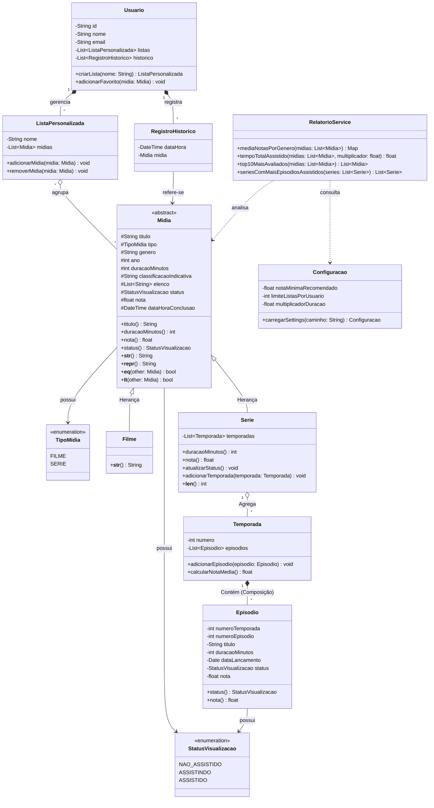

```mermaid
classDiagram
    direction TB

    class StatusVisualizacao {
        <<enumeration>>
        NAO_ASSISTIDO
        ASSISTINDO
        ASSISTIDO
    }

    class TipoMidia {
        <<enumeration>>
        FILME
        SERIE
    }

    class Midia {
        <<abstract>>
        #String titulo
        #TipoMidia tipo
        #String genero
        #int ano
        #int duracaoMinutos
        #String classificacaoIndicativa
        #List~String~ elenco
        #StatusVisualizacao status
        #float nota
        #DateTime dataHoraConclusao
        +titulo() String
        +duracaoMinutos() int
        +nota() float
        +status() StatusVisualizacao
        +__str__() String
        +__repr__() String
        +__eq__(other: Midia) bool
        +__lt__(other: Midia) bool
    }

    class Filme {
        +__str__() String
    }

    class Serie {
        -List~Temporada~ temporadas
        +duracaoMinutos() int
        +nota() float
        +atualizarStatus() void
        +adicionarTemporada(temporada: Temporada) void
        +__len__() int
    }

    class Temporada {
        -int numero
        -List~Episodio~ episodios
        +adicionarEpisodio(episodio: Episodio) void
        +calcularNotaMedia() float
    }

    class Episodio {
        -int numeroTemporada
        -int numeroEpisodio
        -String titulo
        -int duracaoMinutos
        -Date dataLancamento
        -StatusVisualizacao status
        -float nota
        +status() StatusVisualizacao
        +nota() float
    }

    class Usuario {
        -String id
        -String nome
        -String email
        -List~ListaPersonalizada~ listas
        -List~RegistroHistorico~ historico
        +criarLista(nome: String) ListaPersonalizada
        +adicionarFavorito(midia: Midia) void
    }

    class ListaPersonalizada {
        -String nome
        -List~Midia~ midias
        +adicionarMidia(midia: Midia) void
        +removerMidia(midia: Midia) void
    }

    class RegistroHistorico {
        -DateTime dataHora
        -Midia midia
    }

    class Configuracao {
        -float notaMinimaRecomendado
        -int limiteListasPorUsuario
        -float multiplicadorDuracao
        +carregarSettings(caminho: String) Configuracao
    }

    class RelatorioService {
        +mediaNotasPorGenero(midias: List~Midia~) Map
        +tempoTotalAssistido(midias: List~Midia~, multiplicador: float) float
        +top10MaisAvaliados(midias: List~Midia~) List~Midia~
        +seriesComMaisEpisodiosAssistidos(series: List~Serie~) List~Serie~
    }

    %% Relacionamentos de Herança
    Midia <|-- Filme : Herança
    Midia <|-- Serie : Herança

    %% Agregação e Composição de Séries
    Serie "1" o-- "*" Temporada : Agrega
    Temporada "1" *-- "*" Episodio : Contém (Composição)

    %% Uso de Enums
    Midia --> TipoMidia : possui
    Midia --> StatusVisualizacao : possui
    Episodio --> StatusVisualizacao : possui

    %% Relacionamentos de Usuário
    Usuario "1" *-- "*" ListaPersonalizada : gerencia
    Usuario "1" *-- "*" RegistroHistorico : registra
    ListaPersonalizada "*" o-- "*" Midia : agrupa
    RegistroHistorico --> Midia : refere-se

    %% Serviços e Configurações
    RelatorioService ..> Midia : analisa
    RelatorioService ..> Configuracao : consulta
```

